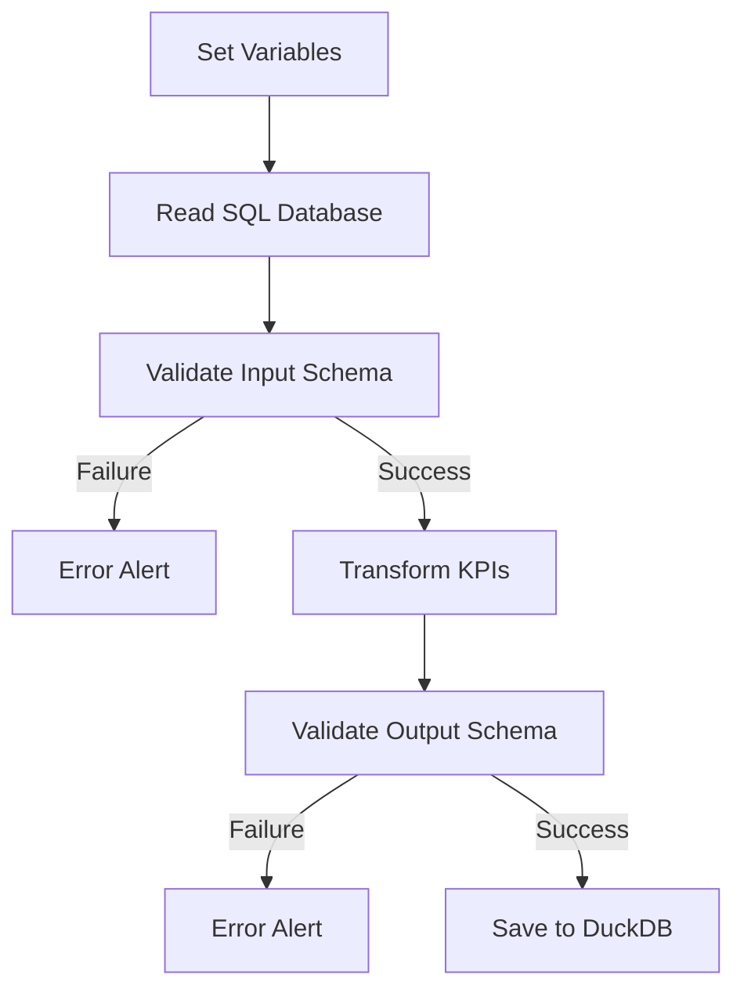

# Data quality workshop

To develop the business challenge, we will set up the following ETL

```mermaid
graph TD;
    A[Set Variables] --> B[Read SQL Database];
    B --> V[Validate Input Schema];
    V -->|Failure| X[Error Alert];
    V -->|Success| C[Transform KPIs];
    C --> Y[Validate Output Schema];
    Y -->|Failure| Z[Error Alert];
    Y -->|Success| D[Save to DuckDB];
```